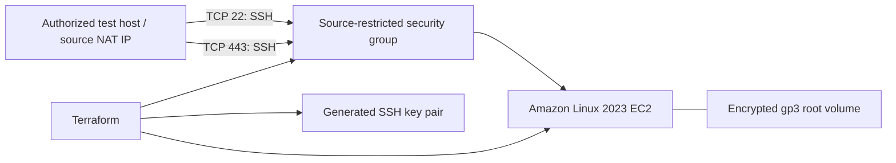

# External Connectivity Lab

**Terraform-managed AWS infrastructure for authorized outbound connectivity testing.**

This penetration-testing lab provisions an Amazon Linux 2023 EC2 host with SSH listeners on TCP **22** and **443**. It provides a controlled external endpoint for comparing outbound access across two ports, with source-restricted ingress and reproducible infrastructure.

This release contains the infrastructure layer. OAST (out-of-band application security testing) callback collection and integration with external C2 tooling are future extensions. No C2 application, agent, DNS callback service, or HTTP interaction collector is included.

## Skills demonstrated

- **Security testing infrastructure:** an external endpoint for assessing outbound TCP access from an authorized source network.
- **Infrastructure as code:** AWS resources, provider constraints, dependency management, and reusable Terraform inputs and outputs.
- **Linux administration:** first-boot SSH configuration, syntax validation, backups, and service management.
- **Cloud security controls:** source-restricted ingress, public-key authentication, encrypted storage, and required IMDSv2 tokens.
- **Operational discipline:** deployment guidance, evidence collection, teardown, and separation of source code from secrets.

## Architecture



Both ports speak **SSH**. Port 443 does not provide HTTPS or establish whether an HTTPS proxy will permit web traffic. Connections travel outbound from the test host and inbound to EC2.

## Included capabilities

| Component | Implementation |
| --- | --- |
| Compute | One `t2.micro`, latest matching Amazon Linux 2023 x86_64 AMI |
| Network | Existing default VPC; TCP 22 and 443 ingress from `trusted_ip_cidr` |
| Authentication | RSA-4096 key; bootstrap config disables password and root login |
| SSH controls | Agent, TCP, and X11 forwarding disabled; three authentication attempts; 30-second login grace period |
| Metadata | IMDSv2 required; response hop limit of one |
| Storage | Encrypted 30 GiB gp3 root volume, deleted on termination |
| Bootstrap | Configuration backup and `sshd -t` validation before restart |
| Outputs | Instance details, public address, security group, and SSH commands |

## Quick start

### Prerequisites

- Terraform 1.6 or later and AWS credentials configured for the intended account.
- AWS permissions to manage EC2 instances, security groups, and key pairs, and read AMI/VPC details.
- An existing default VPC with a default subnet, internet routing, and public IPv4 assignment enabled. This configuration does not create those network resources.
- OpenSSH and the public source/NAT IPv4 address of the authorized test host.

EC2, EBS, and public IPv4 usage may incur charges. This project makes no zero-cost guarantee.

```bash
git clone https://github.com/theMUGGLER/external-connectivity-lab.git
cd external-connectivity-lab
cp terraform.tfvars.example terraform.tfvars
```

In PowerShell, use `Copy-Item terraform.tfvars.example terraform.tfvars`. Edit the copied file, replacing the documentation address with the approved source IP and `/32` prefix. Use unique project and key names for multiple deployments in one account.

```hcl
aws_region      = "us-east-1"
environment     = "dev"
project_name    = "hardened-ec2"
key_name        = "hardened-ec2-key"
trusted_ip_cidr = "203.0.113.10/32" # Replace before deployment
```

```bash
terraform init
terraform fmt -check
terraform validate
terraform plan
terraform apply
```

Review the plan before approving it. Allow cloud-init to finish before testing. The private key is written with POSIX mode `0600`; on Windows, check its NTFS permissions before using OpenSSH.

```bash
terraform output ssh_command_port_22
terraform output ssh_command_port_443
ssh -i keys/hardened-ec2-key.pem -p 22 ec2-user@<public_ip>
ssh -i keys/hardened-ec2-key.pem -p 443 ec2-user@<public_ip>
```

Verify the host-key fingerprint through a trusted channel before accepting the first connection.

## Authorized testing workflow

1. Agree the source network, destination, ports, and testing window with the system owner.
2. Deploy the endpoint and verify both server listeners are healthy.
3. Attempt each SSH connection from the approved test host. For TCP-only checks in PowerShell:

   ```powershell
   Test-NetConnection -ComputerName <public_ip> -Port 22
   Test-NetConnection -ComputerName <public_ip> -Port 443
   ```

4. Record UTC timestamp, source/NAT address, destination port, TCP result, and SSH authentication result separately. A TCP handshake does not prove authentication or an OAST interaction.
5. Correlate observations with server and network logs, then destroy the lab when finished.

Timeouts can result from source egress controls, AWS ingress rules, routing, a changed NAT address, or an unhealthy listener. Confirm destination health before attributing a failure to outbound filtering.

### Verify the deployed host

```bash
sudo cloud-init status --wait
sudo ss -tlnp
sudo sshd -t
sudo sshd -T | grep -E '^(port|passwordauthentication|kbdinteractiveauthentication|permitrootlogin|pubkeyauthentication|allowtcpforwarding|allowagentforwarding|x11forwarding|maxauthtries) '
sudo cat /var/log/user-data.log
sudo journalctl -u sshd --no-pager -n 50
```

Inspect `/var/log/cloud-init-output.log` if bootstrap fails. Included SSH configuration files can affect effective authentication settings; verify the deployed result with `sshd -T`. If SELinux is enforcing, confirm its policy permits SSH to bind TCP 443. Terraform validation does not verify these runtime conditions.

## Configuration

| Variable | Default | Purpose |
| --- | --- | --- |
| `aws_region` | `us-east-1` | Deployment region |
| `environment` | `dev` | Environment tag |
| `project_name` | `hardened-ec2` | Resource naming prefix |
| `key_name` | `hardened-ec2-key` | EC2 key-pair name and PEM filename |
| `trusted_ip_cidr` | Required | Allowed source IPv4 CIDR; use `/32` for one host |

Input validation checks IPv4 CIDR syntax; it does not enforce `/32`. Review the configured range before applying.

## Design boundaries

- Listeners are fixed to TCP 22 and 443; there is no arbitrary-port configuration or automated probe runner.
- EC2 security-group egress permits all outbound IPv4 traffic. The lab measures outbound connectivity from the test host.
- SSH occupies port 443. Adding an HTTPS callback collector requires a deliberate listener/network redesign.
- IMDSv2 reduces exposure to some metadata-access attack paths; it is not a complete SSRF defense.
- The AMI lookup selects the latest matching image at plan time. The provider lock file pins provider versions, not the AMI.
- User-data changes replace the instance. Review plans carefully when modifying bootstrap behavior.

## State and key handling

Terraform stores the generated private key in state as well as `keys/`. Treat state, backups, saved plans, and keys as credentials. Sensitive output markings do not encrypt state. For shared deployments, configure access-controlled encrypted remote state with locking appropriate to your backend.

Deployment variables, state, keys, plans, logs, and local credentials are excluded from version control. Commit sanitized examples only. Changing `key_name` alone does **not** rotate `tls_private_key.ssh_key`; rotation requires an explicit replacement plan and corresponding host access changes.

See [SECURITY.md](SECURITY.md) for reporting guidance.

## Teardown

```bash
terraform plan -destroy
terraform destroy
```

Confirm the intended account and resources before approving destruction. Verify cloud resources were removed, then remove residual local keys and state backups according to your retention policy. Keep testing evidence separate from source code.

## Repository layout

```text
.
|-- main.tf                    # Providers, resources, SSH bootstrap
|-- variables.tf               # Inputs and CIDR validation
|-- outputs.tf                 # Resource details and SSH commands
|-- terraform.tfvars.example   # Sanitized template
|-- .terraform.lock.hcl        # Provider versions and checksums
|-- .github/workflows/         # Formatting and validation checks
|-- .gitignore                 # Credential and deployment exclusions
|-- SECURITY.md                # Reporting guidance
`-- README.md
```

## Planned extensions

- Configurable ports with matching listeners and security-group rules.
- HTTP/DNS OAST callbacks with correlation identifiers and structured logs.
- Automated connectivity checks with exportable evidence.

These are roadmap items, not capabilities of this release. Use this project only for systems and networks you are authorized to assess.
